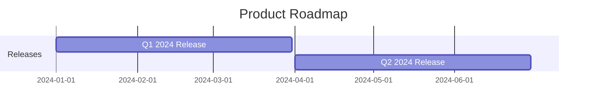
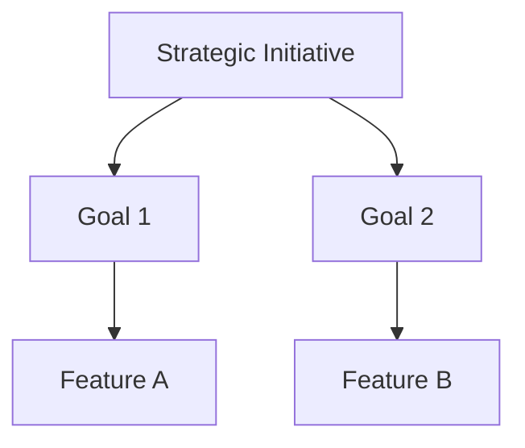
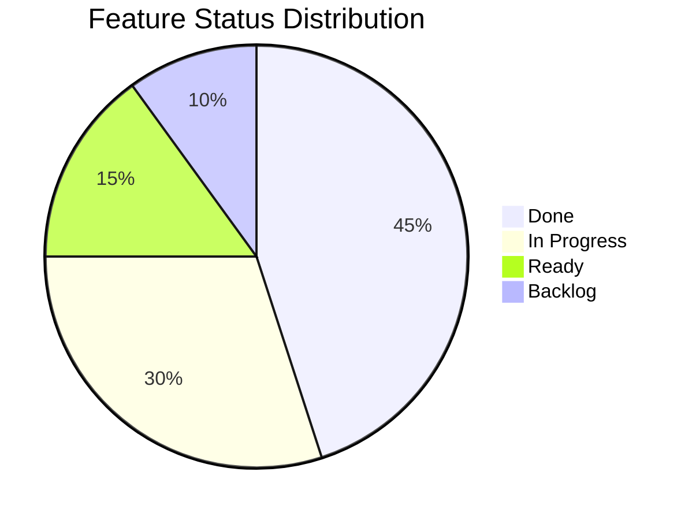

# Generating Diagrams

The `render` package enables visualization of Aha.io data as diagrams. Generate roadmaps, dependency graphs, and organizational views in various formats.

## Supported Formats

| Format | Description | Use Case |
|--------|-------------|----------|
| Mermaid | Text-based diagrams | Embed in Markdown, documentation |
| D2 | Declarative diagrams | High-quality exports |
| SVG | Vector graphics | Web embedding, presentations |

## Roadmap Diagrams

### Generate Mermaid Timeline

```go
import "github.com/grokify/aha-go/render"

releases, _ := client.ListReleases(ctx, "PRODUCT-KEY")

mermaid := render.ReleasesToMermaid(releases, render.MermaidOptions{
    Title:     "Product Roadmap",
    ShowDates: true,
})

fmt.Println(mermaid)
```

Output:



### With Features

```go
releases, _ := client.ListReleases(ctx, "PRODUCT-KEY")

for _, rel := range releases {
    features, _ := client.ListFeatures(ctx, "PRODUCT-KEY",
        aha.WithRelease(rel.ReferenceNum),
    )
    rel.Features = features
}

mermaid := render.RoadmapToMermaid(releases, render.MermaidOptions{
    Title:        "Detailed Roadmap",
    ShowFeatures: true,
    ShowDates:    true,
})
```

## Dependency Graphs

### Feature Dependencies

```go
features, _ := client.ListFeatures(ctx, "PRODUCT-KEY",
    aha.WithRelease("REL-2024Q1"),
)

d2 := render.FeatureDependenciesToD2(features, render.D2Options{
    Title:     "Feature Dependencies",
    Direction: "right",
})

// Write to file for rendering
os.WriteFile("deps.d2", []byte(d2), 0644)
```

Output (D2 format):

```d2
direction: right
title: Feature Dependencies

FEAT-1: User Auth
FEAT-2: Dashboard
FEAT-3: API Endpoints

FEAT-2 -> FEAT-1: depends on
FEAT-3 -> FEAT-1: depends on
```

### Render to SVG

```go
d2Content := render.FeatureDependenciesToD2(features, render.D2Options{})

svg, err := render.D2ToSVG(d2Content)
if err != nil {
    log.Fatal(err)
}

os.WriteFile("deps.svg", svg, 0644)
```

## Initiative Hierarchy

### Initiative to Goals to Features

```go
initiatives, _ := client.ListInitiatives(ctx, "PRODUCT-KEY")

for _, init := range initiatives {
    goals, _ := client.ListGoals(ctx, "PRODUCT-KEY",
        aha.WithInitiative(init.ID),
    )
    init.Goals = goals

    for _, goal := range goals {
        features, _ := client.ListFeatures(ctx, "PRODUCT-KEY",
            aha.WithGoal(goal.ID),
        )
        goal.Features = features
    }
}

mermaid := render.InitiativeHierarchyToMermaid(initiatives)
```

Output:



## Status Visualizations

### Feature Status Distribution

```go
features, _ := client.ListFeatures(ctx, "PRODUCT-KEY")

mermaid := render.StatusDistributionToPie(features, render.PieOptions{
    Title: "Feature Status Distribution",
})
```

Output:



### Release Progress

```go
type ReleaseProgress struct {
    Release string
    Total   int
    Done    int
}

var progress []ReleaseProgress
for _, rel := range releases {
    features, _ := client.ListFeatures(ctx, "PRODUCT-KEY",
        aha.WithRelease(rel.ReferenceNum),
    )

    rp := ReleaseProgress{
        Release: rel.Name,
        Total:   len(features),
    }
    for _, f := range features {
        if f.Status == "Done" {
            rp.Done++
        }
    }
    progress = append(progress, rp)
}

mermaid := render.ProgressToBar(progress)
```

## Embedding in Documentation

### Markdown with Mermaid

```go
func generateRoadmapDoc(ctx context.Context, client *aha.Client, product string) string {
    releases, _ := client.ListReleases(ctx, product)

    var sb strings.Builder
    sb.WriteString("# Product Roadmap\n\n")
    sb.WriteString("```mermaid\n")
    sb.WriteString(render.ReleasesToMermaid(releases, render.MermaidOptions{}))
    sb.WriteString("\n```\n")

    return sb.String()
}
```

### HTML with SVG

```go
func generateRoadmapHTML(ctx context.Context, client *aha.Client, product string) string {
    features, _ := client.ListFeatures(ctx, product)

    d2 := render.FeaturesToD2(features, render.D2Options{})
    svg, _ := render.D2ToSVG(d2)

    return fmt.Sprintf(`
<!DOCTYPE html>
<html>
<head><title>Roadmap</title></head>
<body>
    <h1>Feature Dependencies</h1>
    %s
</body>
</html>
`, string(svg))
}
```

## CLI Rendering

### Generate Mermaid

```bash
# Output Mermaid to stdout
aha render roadmap --product PRODUCT-KEY --format mermaid

# Save to file
aha render roadmap --product PRODUCT-KEY --format mermaid > roadmap.md
```

### Generate SVG

```bash
# Feature dependencies as SVG
aha render dependencies --product PRODUCT-KEY --release REL-Q1 --format svg > deps.svg
```

## Customization

### Mermaid Options

```go
opts := render.MermaidOptions{
    Title:         "My Roadmap",
    Theme:         "dark",
    ShowDates:     true,
    ShowFeatures:  true,
    DateFormat:    "YYYY-MM-DD",
    Direction:     "TB", // Top to Bottom
}

mermaid := render.ReleasesToMermaid(releases, opts)
```

### D2 Options

```go
opts := render.D2Options{
    Title:     "Dependencies",
    Direction: "right",
    Theme:     "terminal",
    Sketch:    true, // Hand-drawn style
}

d2 := render.FeaturesToD2(features, opts)
```

## Best Practices

### Caching Rendered Diagrams

```go
func getCachedDiagram(cacheDir, key string, generate func() string) string {
    cachePath := filepath.Join(cacheDir, key+".mmd")

    // Check cache
    if data, err := os.ReadFile(cachePath); err == nil {
        return string(data)
    }

    // Generate and cache
    diagram := generate()
    os.WriteFile(cachePath, []byte(diagram), 0644)
    return diagram
}
```

### Incremental Updates

```go
// Only regenerate if data changed
func shouldRegenerate(cacheFile string, lastUpdated time.Time) bool {
    info, err := os.Stat(cacheFile)
    if err != nil {
        return true
    }
    return lastUpdated.After(info.ModTime())
}
```
